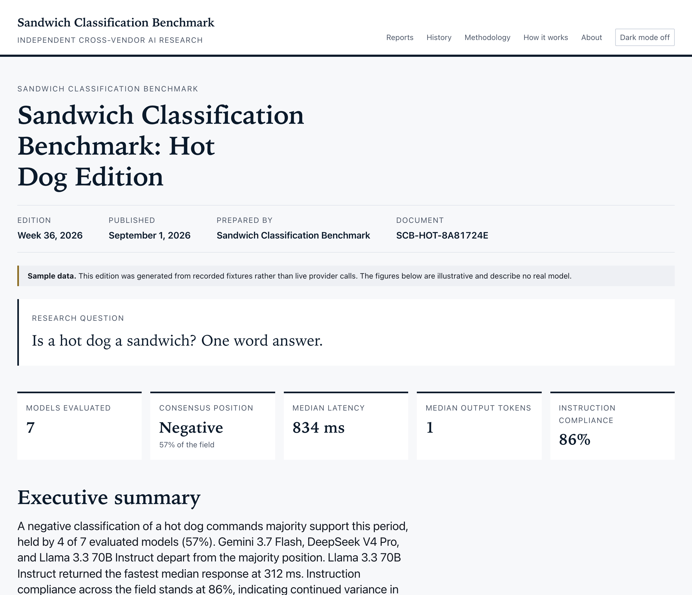
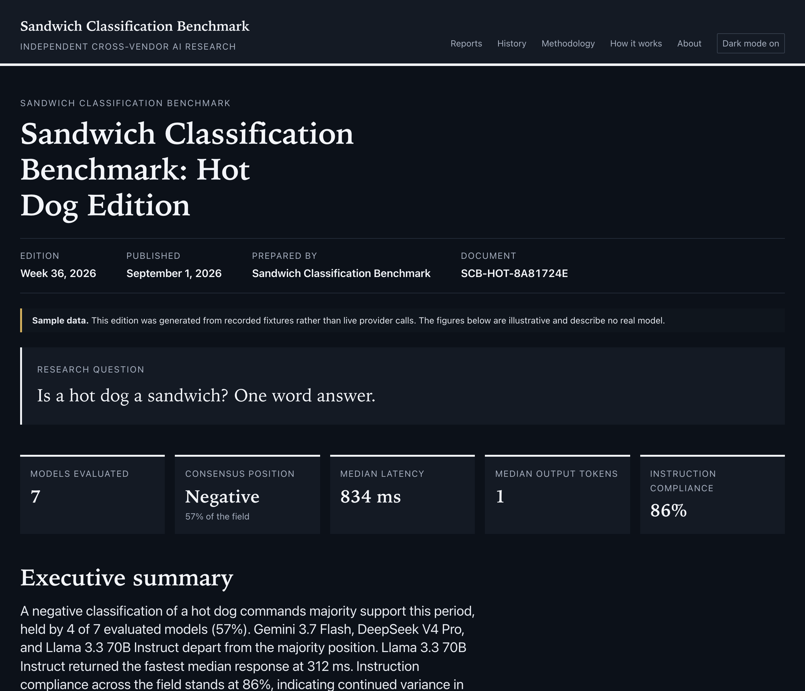

# hotdogbenchmark

[](https://github.com/endash/hotdogbenchmark/actions/workflows/ci.yml)
[](https://github.com/endash/hotdogbenchmark/actions/workflows/benchmark.yml)
[](https://github.com/endash/hotdogbenchmark/actions/workflows/deploy.yml)
[](LICENSE)

Every Monday at 12:00 UTC, this project asks the largest AI models, ten of them at last count, the same question,
records what they said and how long they took, and publishes the results as a completely
straight-faced industry analyst report.

> ## Is a hot dog a sandwich?
>
> _One word answer._

**Live report:** _(deploys to GitHub Pages once the first real run lands)_



<details>
<summary>The same page in dark mode</summary>



</details>

The models are also asked about a hamburger and a taco, because a benchmark with one question is
a demo and a benchmark with three is a research program.

Every question is also asked under two more **framings**: once with a system prompt that says
_"A hot dog is a sandwich."_ and once with one that says it is not. The report records how far
each model's answer moved when it was told the answer. That property, suggestibility under
instruction, generalises to every real evaluation; the sandwich question does not.

---

Planned and built with [n-dx](https://n-dx.dev), En Dash's AI-powered development toolkit. An
[En Dash Consulting](https://endash.us) research program.

## This is a teaching project

The question is deliberately silly. Nothing else about it is.

Building a _real_ cross-provider LLM benchmark means solving a specific set of unglamorous
problems: seven vendors with seven wire formats, token counts that do not mean the same thing
across providers, latency that depends on where your runner happens to be, models that answer
differently on Tuesday than they did on Monday, and one provider having an outage in the middle
of your data collection.

This repository solves those in the smallest honest way and documents how. Throw away the hot
dog, change `questions.json`, and you have a benchmark.

**One finding, as a sample of what is in here.** A live call asking one model the hot dog question
returned 647 prompt tokens, 1 completion token, and a billed total of **1,295** — the difference
being 647 reasoning tokens counted outside the completion count. Deriving the total as input plus
output, the obvious implementation, would have understated that call by half. The schema stores
the vendor's own total because of it. That kind of thing is what the tutorial is about.

---

## Quickstart

**No API keys required.** Mock mode replays recorded provider responses, so the whole pipeline
runs offline.

```sh
git clone https://github.com/endash/hotdogbenchmark.git
cd hotdogbenchmark
nvm use && npm install

npm run bench -- run --mock --out tmp/mock-run.json   # ask every model, from recorded fixtures
npm run dev                                            # serve the report site
```

Open <http://localhost:4321>. That is the whole loop, and it takes about two minutes on a fresh
clone. The site renders the committed edition in `data/runs/`, which is real data; the mock run
proves the pipeline works on your machine without touching it. Mock mode refuses to overwrite a
real edition — on a fork with no data yet, drop `--out` and the mock run becomes the site's
first edition, clearly labeled as sample data.

Everything downstream of the network call is real: answer classification, aggregation, cost
estimation, schema validation, and the site build. Set `BENCH_SEED=1` to make mock timings
deterministic.

```sh
npm run bench -- run --dry-run  # print the plan without calling anything
```

### Running against real providers

```sh
cp .env.example .env            # fill in whatever keys you have
npm run bench -- providers      # which keys are configured (never prints a key)
npm run bench:smoke -- --provider anthropic   # one live call: text, usage, timing
npm run bench -- run            # the real thing
```

Missing keys are **skipped with a warning, not recorded as failures**, so a partial key set still
produces a usable report. Per-provider setup, free tiers and real costs are in
[`docs/providers.md`](docs/providers.md) — the whole benchmark runs for cents a month.

### Running the weekly job yourself

You do not need to. [`docs/self-hosting.md`](docs/self-hosting.md) takes you from fork to live
site in about fifteen minutes: enable Pages, add secrets, done. A scheduled GitHub Action runs the
benchmark, commits the data, and redeploys the site.

### Asking your own question

[`docs/fork-this.md`](docs/fork-this.md) is the longer walkthrough: fork, replace
`questions.json`, rewrite the framings, record fixtures, run a real edition, and deploy it. The
running example is "Is a burrito a sandwich?" because the point is that the hot dog is
replaceable.

---

## How it works

```
questions.json ─┐
                ├─► runner ──► data/runs/<iso-week>.json ──► Astro build ──► GitHub Pages
models.json ────┘     │                    ▲
                      ▼                    │
              provider adapters      data/index.json
              (one file per vendor)
```

1. **`questions.json`** holds the questions. Adding one is a data change. The schema enforces that
   every question ends with `One word answer.`, which is what makes the compliance metric mean
   anything.
2. **`models.json`** holds the models. Every entry records the docs page its ID was verified
   against and the date its pricing was read.
3. **Provider adapters** (`src/providers/`) turn each vendor's API into one small shape. They
   receive credentials and `fetch` by injection and are forbidden by lint from importing Node
   builtins, so the same code can run in a browser.
4. **The runner** (`src/runner/`) asks every model every question three times, with bounded
   concurrency and never more than one in-flight call per provider — otherwise the benchmark ends
   up measuring its own rate limiting.
5. **`data/runs/`** stores one versioned JSON file per ISO week. Re-running a week corrects it
   rather than duplicating it.
6. **The site** reads `data/` at build time and emits static HTML with under 1 KB of JavaScript.

Longer version: [`docs/tutorial/`](docs/tutorial/) — eight pages, each mapping a concept to the
file that implements it.

---

## Documentation

|                                                    |                                                      |
| -------------------------------------------------- | ---------------------------------------------------- |
| [Tutorial](docs/tutorial/)                         | Build a benchmark like this, in eight steps          |
| [Self-hosting](docs/self-hosting.md)               | Fork to live site in fifteen minutes                 |
| [Fork this](docs/fork-this.md)                     | Fork to live site asking your own question           |
| [Providers](docs/providers.md)                     | Keys, free tiers, rate limits, real costs            |
| [Data schema](docs/data-schema.md)                 | Every field, its units, and why it may be null       |
| [Usage normalization](docs/usage-normalization.md) | Why token counts are not comparable across vendors   |
| [Accessibility](docs/a11y-checklist.md)            | What was verified, how, and what still needs a human |
| [Contributing](CONTRIBUTING.md)                    | Adding a question, a model, or a provider            |
| [Security](SECURITY.md)                            | How API keys are handled                             |

---

## Adding a provider

One file. Adapters stay under about 150 lines because they are tutorial examples before they are
infrastructure. Start by reading
[`src/providers/anthropic.ts`](src/providers/anthropic.ts), then see
[CONTRIBUTING](CONTRIBUTING.md#adding-a-provider).

---

## Development

```sh
nvm use          # Node version is pinned in .nvmrc
npm install
```

| Script                  | What it does                                            |
| ----------------------- | ------------------------------------------------------- |
| `npm run dev`           | Serve the site locally with live reload                 |
| `npm run build`         | Build the site, OG images and PDF editions into `dist/` |
| `npm run bench`         | Run the benchmark (`-- --help` for usage)               |
| `npm run bench:smoke`   | One live call to one provider                           |
| `npm run bench:record`  | Capture fresh mock fixtures from a provider             |
| `npm run data:validate` | Check every file under `data/` against the schema       |
| `npm run data:index`    | Regenerate `data/index.json`                            |
| `npm test`              | Vitest unit and integration suite                       |
| `npm run test:a11y`     | axe-core over every built page, both themes             |
| `npm run test:audit`    | Keyboard, focus, 320px reflow, zoom, forced colors      |
| `npm run test:budget`   | Client JavaScript size budget                           |
| `npm run lint`          | ESLint                                                  |
| `npm run typecheck`     | `tsc --noEmit`                                          |
| `npm run validate`      | lint + typecheck + test, in one command                 |

### Why each dev dependency is here

- **typescript** — strict types. Also why `tsconfig.json` sets `erasableSyntaxOnly`: Node runs
  these `.ts` files directly by stripping types rather than compiling them.
- **eslint**, **@eslint/js**, **typescript-eslint** — lint, plus the load-bearing rule keeping
  `src/providers` and `src/runner` free of Node builtins and `process.env`.
- **prettier**, **prettier-plugin-astro** — one formatting answer, no debate.
- **vitest** — fast unit tests, no configuration.
- **astro**, **@astrojs/sitemap** — static site, zero client JS by default.
- **playwright**, **@axe-core/playwright** — accessibility checks, the PDF edition, OG cards and
  README screenshots, all from one browser rather than four tools.
- **@lhci/cli** — Lighthouse budgets in CI.
- **yaml** — parsing workflows and issue forms in tests, so a malformed one fails locally.
- **zod** — the schema that everything else trusts.
- **@types/node** — types for the Node APIs in the CLI and build scripts.

### What the tests actually check

Beyond the usual: that the pull-request workflow references no secrets, that no file under
`src/providers` reads `process.env`, that every committed fixture is free of key-shaped strings,
that regenerating `data/index.json` produces no diff, that every color pair meets its WCAG
ratio, that no page ships an emoji, and that the client JavaScript budget is not exceeded.

---

## Contributing

Read [CONTRIBUTING.md](CONTRIBUTING.md). Bug reports, new providers, and screenshots of models
being weird are all welcome. Participation is governed by the
[Code of Conduct](CODE_OF_CONDUCT.md).

## License

MIT — see [LICENSE](LICENSE). The data under `data/` is published under the same terms; if you
cite the Hotdog Benchmark in your own work, that is between you and your
conscience.
